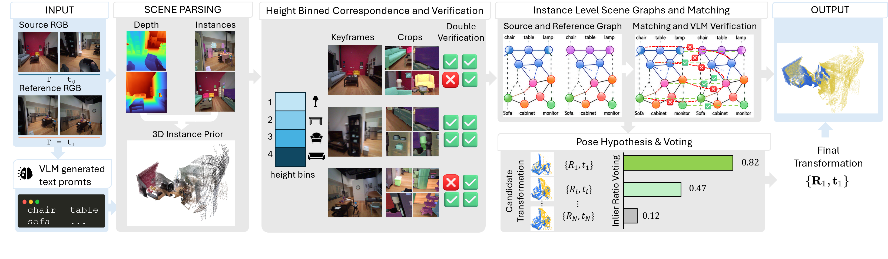

<h1 align="center">PROSE: Training-Free Egocentric Scene Registration<br>with Vision-Language Models</h1>

<div align="center">

[Zhiang Chen](https://RCKola.github.io/)\*<sup>,1</sup>,
[Nahyuk Lee](https://nahyuklee.github.io/)\*,
[Boyang Sun](https://boysun045.github.io/boysun-website/)<sup>1</sup>,
[Taein Kwon](https://taeinkwon.com/)<sup>2</sup>,
[Marc Pollefeys](https://cvg.ethz.ch/team/Prof-Dr-Marc-Pollefeys)<sup>1</sup>,
[Zuria Bauer](https://zuriabauer.com/)<sup>†,1</sup>,
[Sunghwan Hong](https://sunghwanhong.github.io/)<sup>†,1,3</sup>

<sup>1</sup> [ETH Zurich](https://ethz.ch/en.html) &ensp; <sup>2</sup> [VGG, University of Oxford](https://www.robots.ox.ac.uk/~vgg/) &ensp; <sup>3</sup> [ETH AI Center](https://ai.ethz.ch/)<br>
\* equal contribution &ensp; † equal advising

[](https://www.corl.org/)
[](https://rckola.github.io/prose/)
[](https://www.youtube.com/watch?v=Hf1oWjFr45M)

</div>

<p align="center">
  
</p>

**_TL;DR:_** *Register two egocentric RGB sequences of the same indoor scene by lifting each into an object-level 3D scene graph with off-the-shelf foundation models, then prompting a VLM to match instances across scans — no depth sensor, no training, no annotated graph.*

## Table of Contents

- [Overview](#overview)
- [Getting Started](#getting-started)
  - [Setup](#setup)
    - [FCGF backend](#fcgf-backend)
  - [Foundation-Model Weights](#foundation-model-weights)
- [Usage](#usage)
  - [Data Preparation](#data-preparation)
  - [Running the Pipeline](#running-the-pipeline)
  - [Evaluation](#evaluation)
- [Advanced](#advanced)
  - [Configurations](#configurations)
  - [FAQ](#faq)
  - [TODO](#todo)
- [Acknowledgments](#acknowledgments)
- [License](#license)


## Overview

**PROSE** (**Pro**mpted **S**cene r**E**gistration) recovers the rigid transform aligning two egocentric RGB captures of the same indoor space taken at different times. Rather than relying on the clean point clouds that egocentric, RGB-only capture lacks, PROSE uses pretrained foundation models for geometry, segmentation, and language, and prompts a VLM for both scene understanding and cross-scan matching. **It adds no learned parameters and needs no depth sensor, training, or annotated scene graph.**

The pipeline runs in six stages — four per-subscan (scene parsing) and two per-pair:

| Stage | Module | Model | Role |
|:--|:--|:--|:--|
| 1. Geometry | `stages/geometry.py` | **VGGT-Ω** / GT | per-frame depth + camera → per-subscan point cloud |
| 2. Object listing | `stages/object_listing.py` | **Qwen3.6-27B** | VLM lists the objects worth matching |
| 3. Segmentation | `stages/segmentation.py` | **SAM 3** | text-prompted, temporally consistent instance masks |
| 4. Fusion | `stages/fusion.py` | — | per-instance 3D fusion → scene graph G=(V,E): instance nodes (+ OBB) and proximity edges |
| 5. Correspondence | `stages/correspondence/` | **Qwen3.6-27B** | height-binned Set-of-Marks matching + same/different double-check |
| 6. Registration | `stages/registration.py` | GeoTransformer / FCGF / FPFH | per-pair RANSAC hypotheses + geometric-consensus voting |

### Key features
- **Training-free**: every model is an off-the-shelf checkpoint used as released.
- **Sensor-free**: geometry is estimated from RGB by VGGT-Ω; GT clouds are also supported for the benchmark setting.
- **Object-level scene graph**: the fusion stage emits G=(V,E) per scan — instance nodes (fused point set + PCA oriented box + shape descriptor) and k-NN proximity edges with coarse `above`/`below`/`near` relations — which transfers directly to downstream tasks.
- **Height-binned correspondence**: K=5 quantile height bands with 20% overlap remove trivial distractors — the largest source of improvement in the ablation.
- **Double-check verification**: a paired *same?* / *different?* query suppresses VLM false positives.
- **Three registration backends**: GeoTransformer (default), FCGF, FPFH — swap with one flag.


## Getting Started

### Setup

Clone with submodules (VGGT-Ω, GeoTransformer, FCGF):

```bash
git clone --recursive https://github.com/RCKola/prose.git
cd prose
```

Create a Python 3.10 environment:

```bash
conda create -n prose python=3.10 -y
conda activate prose
```

Install PyTorch (pick the CUDA build matching your driver), then the package:

```bash
pip install torch torchvision --index-url https://download.pytorch.org/whl/cu124
pip install -e .
```

PROSE was developed on a single **H200** GPU. Heavy models are loaded one at a time, so a 32 GB card is workable, but Qwen3.6-27B is the binding constraint — use [vLLM](#configurations) for the object-listing and correspondence stages.

> [!IMPORTANT]
> vLLM hard-pins `torch`, `torchvision` and `torchaudio`, so it **replaces** any
> PyTorch installed before it. If you want vLLM, skip the `--index-url` step above
> and install it in a single resolve instead — vLLM then chooses the torch build:
>
> ```bash
> pip install -e ".[vllm]"
> ```
>
> To keep your own torch build instead, skip vLLM and run the two VLM stages
> through plain `transformers` — slower, but no version constraint:
>
> ```bash
> python scripts/run_pipeline.py \
>     object_listing.vlm_backend=hf correspondence.vlm_backend=hf
> ```

Optional extras:

```bash
pip install -e ".[viz]"      # Open3D — required for the fpfh backend + PLY viz
```

Build the GeoTransformer C++ extension and fetch its 3DMatch weights (only needed for the default registration backend):

```bash
bash scripts/setup_geotransformer.sh
export PYTHONPATH="$(pwd)/third_party/GeoTransformer:$PYTHONPATH"
export LD_LIBRARY_PATH="$(python -c 'import torch, os; print(os.path.dirname(torch.__file__)+"/lib")'):$LD_LIBRARY_PATH"
```

The other two registration backends are set up separately: `fpfh` needs only
Open3D (the `[viz]` extra above), and `fcgf` needs MinkowskiEngine plus its
3DMatch checkpoint.

#### FCGF backend

<details>
<summary>MinkowskiEngine setup, CPU-only build script, and the WarpConvNet route</summary>

The FCGF descriptor runs on [MinkowskiEngine](https://github.com/NVIDIA/MinkowskiEngine).
MinkowskiEngine installs cleanly on the stack FCGF targets — **CUDA 11.x–12.x**,
PyTorch 1.6–2.x — where upstream's one-liner is all you need:

```bash
pip install git+https://github.com/NVIDIA/MinkowskiEngine.git
```

Then fetch the 3DMatch checkpoint (ResUNetBN2C, normalized feature, 2.5 cm
voxel, 32-dim) to the path the config expects:

```bash
mkdir -p weights/fcgf
curl -fsSL -o weights/fcgf/fcgf_3dmatch.pth \
    https://huggingface.co/chrischoy/FCGF/resolve/main/2019-08-19_06-17-41.pth
```

> [!NOTE]
> The URL in FCGF's pre-2026 README (`node1.chrischoy.org`) is dead; upstream
> rehosted the checkpoints on HuggingFace.

`scripts/setup_fcgf.sh` automates both steps. It builds MinkowskiEngine
**CPU-only** — it does not build the CUDA extension — and works around the
issues a 2021-era package hits on a current toolchain (explicit `--blas` to
bypass `numpy.distutils`, the Python 3.10 `collections` ABC moves, and the
`future_fstrings` shim FCGF's own sources need).

For a **CUDA build**, follow the upstream instructions directly —
[MinkowskiEngine](https://github.com/NVIDIA/MinkowskiEngine) and
[FCGF](https://github.com/chrischoy/FCGF).

**WarpConvNet.** Upstream FCGF has since [moved to
WarpConvNet](https://github.com/NVlabs/WarpConvNet), which ships prebuilt wheels
(no compilation) and now marks the MinkowskiEngine paths legacy. PROSE's
`models/fcgf_extractor.py` targets MinkowskiEngine, since that is what the
reported numbers were produced with. Porting it to WarpConvNet is possible — the
weights convert with upstream's `wcn/convert_me_to_wcn.py` — but is **untested
here**.

</details>

Finally, copy the secrets template and set your HuggingFace token:

```bash
cp .env.example .env
# edit .env: set HF_TOKEN (required for gated repos like facebook/sam3)
```

`.env` is auto-loaded on startup — no need to `export` manually.

### Foundation-Model Weights

PROSE is **training-free**, so there are no PROSE checkpoints to release. It composes the following off-the-shelf models:

| Model | Stage | Source | Notes |
|:--|:--|:--|:--|
| **VGGT-Ω** | geometry | [facebook/VGGT-Omega](https://huggingface.co/facebook/VGGT-Omega) | gated; download once, set `VGGT_OMEGA_CKPT`. Only used when `use_gt_pointclouds=false` |
| **SAM 3** | segmentation | [facebook/sam3](https://huggingface.co/facebook/sam3) | gated; accept license, then auto-downloaded via `HF_TOKEN` |
| **Qwen3.6-27B** | listing + correspondence | [Qwen/Qwen3.6-27B](https://huggingface.co/Qwen/Qwen3.6-27B) | auto-downloaded on first run |
| GeoTransformer | registration | [qinzheng93/GeoTransformer](https://github.com/qinzheng93/GeoTransformer) (3DMatch) | fetched by `setup_geotransformer.sh` |
| FCGF | registration | [chrischoy/FCGF](https://github.com/chrischoy/FCGF) (3DMatch) | needs MinkowskiEngine — see [FCGF backend](#fcgf-backend) |
| FPFH | registration | Open3D (handcrafted) | no weights |

The Qwen/SAM3 weights are fetched lazily by HuggingFace on first use, so there is nothing to pre-download; `scripts/setup_geotransformer.sh` fetches the one asset that is not lazily resolved (the GeoTransformer 3DMatch checkpoint).


## Usage

### Data Preparation

PROSE supports **Aria Digital Twin (ADT)**. ADT is gated and has no public programmatic downloader — request access and obtain the signed URLs from the [official release](https://www.projectaria.com/datasets/adt/), then:

```bash
# 1. Download a sequence (signed URLs from the ADT release)
python scripts/download_adt.py --urls-json <ADT_download_urls.json> \
    --output sample_data/adt --sequence Apartment_release_clean_seq133_M1292

# 2. Preprocess to the flat RGB/depth/pose tree the pipeline reads.
#    projectaria_tools wheel coverage lags new Python releases, so use a 3.11 env:
conda create -n prose_adt python=3.11 -y
conda run -n prose_adt pip install projectaria_tools opencv-python
conda run -n prose_adt python preprocessing/adt/preprocess_adt.py \
    --sequence-dir sample_data/adt/Apartment_release_clean_seq133_M1292 \
    --output sample_data/adt_preprocessed

# 3. Rotate frames upright (Aria's RGB sensor is portrait-mounted).
#    This produces rectified_rot/, depth_rot/, poses_rot.npy, intrinsics_rot.npy.
python preprocessing/adt/rotate_adt_artifacts.py \
    --seq-dir sample_data/adt_preprocessed/Apartment_release_clean_seq133_M1292
```

Preprocessing samples frames every 0.5 s, rectifies RGB/depth, and undistorts them. The rotation step then rotates all frames 90° CW into `*_rot/` directories (Aria's temple-mounted sensor produces sideways frames). It also writes the sliding-window subscan pairs (`window=6`, `stride=5`) to `anchors_val.json`. The runtime pipeline reads only this flat tree — no `projectaria_tools` dependency at run time.

### Running the Pipeline

Run the full six-stage pipeline on the ground-truth-cloud benchmark setting:

```bash
python scripts/run_pipeline.py pairs=all
```

Run the **sensor-free** setting (geometry predicted from RGB by VGGT-Ω):

```bash
python scripts/run_pipeline.py pairs=all use_gt_pointclouds=false
```

Every intermediate artifact is cached under `outputs/<date>/<time>/` (one subdir per stage), so re-runs and `skip_stages=[...]` resume instantly. A quick smoke test on one pair:

```bash
python scripts/run_pipeline.py pairs=first_n max_pairs=1
```

### Evaluation

Evaluation runs automatically after registration (`run_evaluation=true`) and writes `evaluation/metrics.json`:

- **Registration** — Registration Recall (RR; RRE < 5° and RTE < 0.2 m), RRE, RTE, Valid Ratio.
- **Correspondence** — node precision / recall / F1 against the SAM3↔SAM3 mutual-NN IoU ground truth, for the raw and double-checked match sets.

Swap the registration descriptor (all three are reported in the paper):

```bash
python scripts/run_pipeline.py registration.corr_extractor=fcgf   # or fpfh / geotransformer
```

Each backend has its own prerequisites — see [Setup](#setup).


## Advanced

### Configurations

<details>
<summary>Hydra configuration structure</summary>

```
configs/
├── config.yaml             # entry config (defaults + global flags)
├── pipeline/default.yaml   # precision / attention (bf16 + FlashAttention-2)
├── dataset/adt.yaml        # ADT paths + sliding-window params
├── geometry/vggt_omega.yaml
├── object_listing/qwen.yaml
├── segmentation/sam3.yaml
├── fusion/default.yaml
├── correspondence/height_bins.yaml
├── registration/default.yaml
└── output/default.yaml
```

Key global parameters in `config.yaml`:
- `use_gt_pointclouds`: GT clouds (true) vs. VGGT-Ω-predicted clouds (false).
- `pairs`: `all`, `first_n` (+ `max_pairs`), or an explicit list of `"<src>__<ref>"` ids.
- `skip_stages`: list of `geometry, object_listing, segmentation, fusion, correspondence, registration`.
- `registration.corr_extractor`: `geotransformer` (default), `fcgf`, `fpfh`.
- `fusion.scene_graph`: scene-graph edges (`enabled`, `k_neighbors=5`, `radius_m=1.0`, `up_axis`). Stored in `PriorArtifact.edges` as `{src, dst, dist, relation}` records.

Any field is overridable on the command line, e.g.:

```bash
python scripts/run_pipeline.py \
    correspondence.blocking.n_bins=5 \
    correspondence.do_double_check=true \
    registration.corr_extractor=fpfh
```

On older GPUs without FlashAttention-2 / bf16:

```bash
python scripts/run_pipeline.py pipeline.torch_dtype=float16 pipeline.attn_implementation=sdpa
```

</details>

### FAQ

> [!NOTE]
> Please use [GitHub Issues](https://github.com/RCKola/prose/issues) for questions.

> [!TIP]
> If the VGGT-Ω package or checkpoint is missing, the geometry stage logs a warning and falls back to GT point clouds — handy for testing the rest of the pipeline before setting up the gated checkpoint.

### TODO

- [ ] Scene-graph extraction — renderable 3D spatial map
- [ ] Port the FCGF backend to WarpConvNet — drops the MinkowskiEngine build ([FCGF backend](#fcgf-backend))


## Citation

If you find this work useful, please cite:

```bibtex
@inproceedings{chen2026prose,
  title     = {{PROSE}: Training-Free Egocentric Scene Registration with Vision-Language Models},
  author    = {Chen, Zhiang and Lee, Nahyuk and Sun, Boyang and Kwon, Taein and Pollefeys, Marc and Bauer, Zuria and Hong, Sunghwan},
  booktitle = {Conference on Robot Learning (CoRL)},
  year      = {2026},
}
```


## Acknowledgments

PROSE builds on the released checkpoints of [VGGT-Ω](https://github.com/facebookresearch/vggt-omega), [SAM 3](https://github.com/facebookresearch/sam3), [Qwen3.6-VL](https://github.com/QwenLM/Qwen3-VL), [GeoTransformer](https://github.com/qinzheng93/GeoTransformer), and [FCGF](https://github.com/chrischoy/FCGF). We thank the authors of these works.


## License

This project is licensed under the Apache License 2.0 — see the [LICENSE](LICENSE) file for details.
